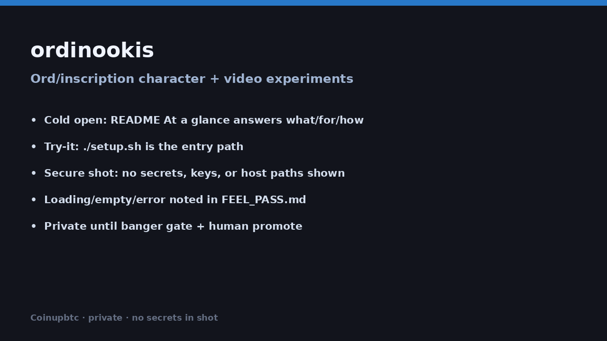

# Ordinookis




Pixel character art + short browser-playable clips.

## At a glance

| | |
|---|---|
| **What it is** | A small gallery of Ordinooki-style characters and short MP4 clips. |
| **What it’s for** | Browse the roster and play the renders in one local page. |
| **How to use it** | Open `index.html`, or `./setup.sh` → http://127.0.0.1:8766/ |

## Try it

### One click
Open [`index.html`](./index.html) in a modern browser.

### One command
```bash
git clone https://github.com/Coinupbtc/ordinookis.git
cd ordinookis && ./setup.sh
# → http://127.0.0.1:8766/
```

## What’s inside

| Path | Contents |
|---|---|
| `characters/` | Five character stills |
| `videos/` | H.264 MP4s (faststart remux for browser play) |
| `prompts.md` | Character notes + prompt log |

## Video note

Clips are remuxed with `moov` at the front (`ffmpeg -movflags +faststart`) so `<video>` playback starts without waiting for a full download.
